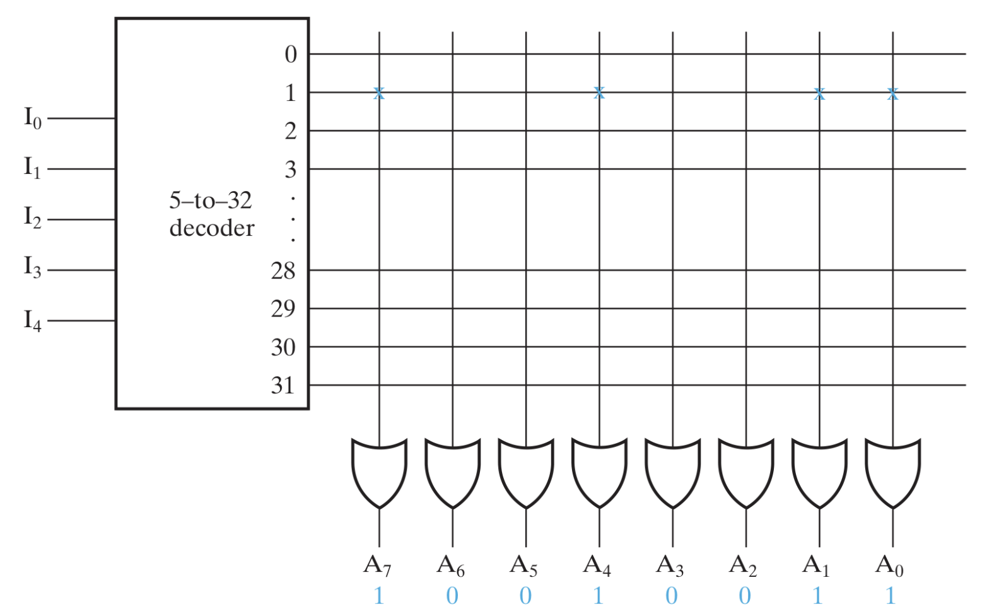
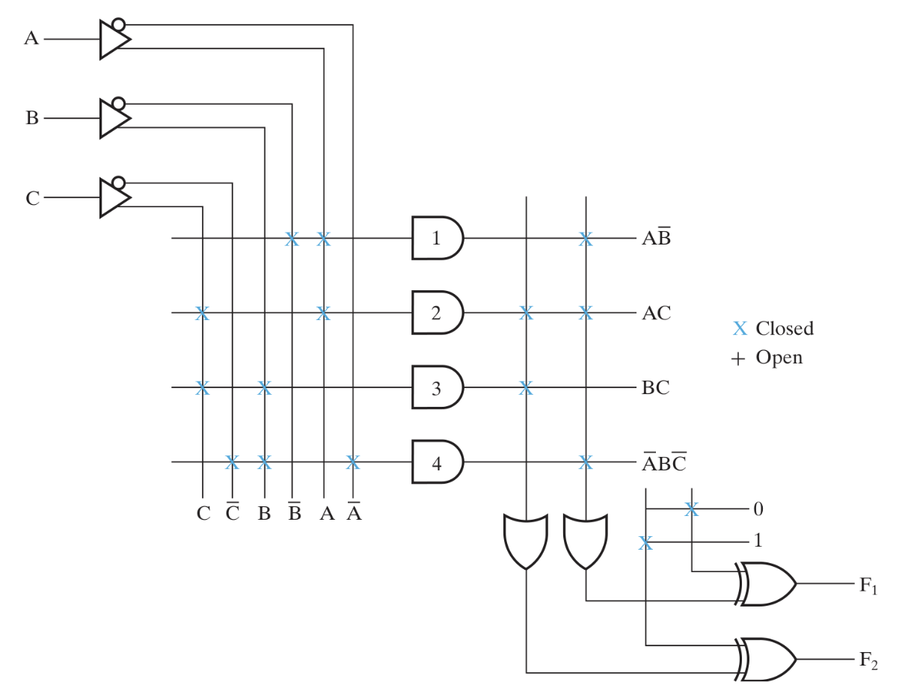
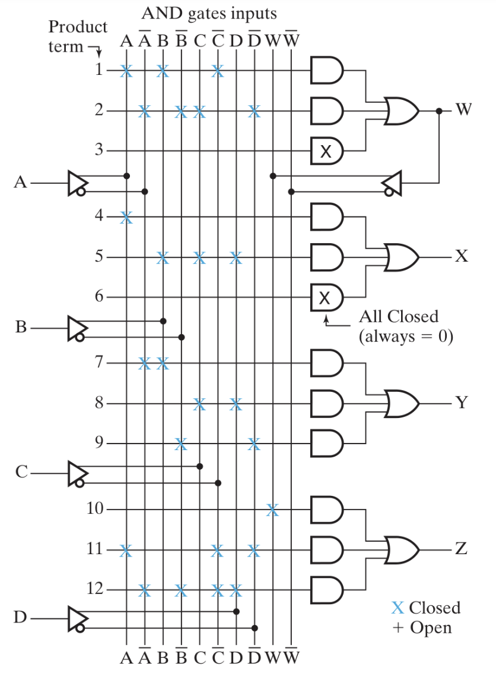

# Digital Hardware Implementation

## 1. The Design Space
The **Design Space** describes the target technologies available for a design and the parameters (metrics) used to characterize them.
* **Target Technology:** Specifies the primitive elements (gates, flip-flops) and their physical properties.
* **Parameters:** Metrics such as speed (propagation delay), power consumption, and silicon area used to evaluate design trade-offs.

---

## 2. Integrated Circuits (ICs)
An **Integrated Circuit** (or **chip**) is a silicon semiconductor crystal containing the components (transistors, resistors, etc.) and connections that constitute a digital circuit.

---

## 3. Levels of Integration
Hardware complexity is categorized by the number of gates per chip:

| Level | Name | Gate Count | Typical Applications |
| :--- | :--- | :--- | :--- |
| **SSI** | Small-Scale Integration | < 10 | Individual gates, simple latches |
| **MSI** | Medium-Scale Integration | 10 – 100 | Adders, MUXs, Decoders, Counters |
| **LSI** | Large-Scale Integration | 100 – 10,000 | 8-bit CPUs, memory chips |
| **VLSI** | Very Large-Scale Integration | > 10,000 | Modern processors, complex FPGAs |

---

## 4. CMOS Technology
**CMOS** (Complementary Metal-Oxide Semiconductor) is the industry-standard fabrication technology for high-density chips.

* **Structure:** Uses paired **NMOS** and **PMOS** transistors.
* **Function:** Because one transistor is always OFF while the other is ON (complementary), the circuit draws almost zero power when in a steady state (static).

---

## 5. MOS Transistor Structure
The **MOS** (Metal-Oxide-Semiconductor) transistor is the fundamental component of CMOS technology, acting as a voltage-controlled switch.

### 5.1 Physical Components
* **Substrate:** The base silicon wafer material.
* **Source & Drain:** Conductive regions where current enters and exits.
* **Gate:** The control terminal that determines if the switch is ON or OFF.
* **Insulator:** A thin oxide layer that prevents current from leaking from the gate into the substrate.
* **Channel:** The gap under the gate that connects the source and drain when a specific voltage is applied.

### 5.2 Operation (Switch Model)
* **ON State:** When gate voltage exceeds a **threshold**, a conductive "bridge" (channel) forms, allowing current to flow.
* **OFF State:** When gate voltage is below the threshold, the channel disappears, blocking current.

---

## 6. Transistor Types: nMOS vs. pMOS
CMOS circuits use two types of MOS transistors to ensure signals remain "strong".

### 6.1 nMOS (n-channel)

* **Logic:** Turns **ON** when Gate is **High (1)**.
* **Strength:** Passes a **Strong 0** (Full Ground).
* **Weakness:** Passes a **Weak 1**.
* **Network:** Used in the **Pull-Down Network**.

### 6.2 pMOS (p-channel)

* **Logic:** Turns **ON** when Gate is **Low (0)** (Symbol has a **bubble** $\circ$).
* **Strength:** Passes a **Strong 1** (Full $V_{DD}$).
* **Weakness:** Passes a **Weak 0**.
* **Network:** Used in the **Pull-Up Network**.

---

## 7. Comparison Summary Table

| Feature | nMOS | pMOS |
| :--- | :--- | :--- |
| **Gate Symbol** | No bubble | Bubble ($\circ$) |
| **ON State** | $V_G = 1$ (High) | $V_G = 0$ (Low) |
| **Strong Signal** | **0** (Ground) | **1** ($V_{DD}$) |
| **Weak Signal** | **1** (Faded) | **0** (Faded) |
| **Placement** | Pull-Down Network | Pull-Up Network |

---

## 8. nMOS Logic Gates
nMOS logic relies on a **Pull-Down Network** and a **Pull-Up Resistor**.

### 8.1 The Pull-Up / Pull-Down Mechanism
* **Pull-Down (nMOS):** When transistors are **ON**, they "pull" the output to **0**.
* **Pull-Up (Resistor):** When transistors are **OFF**, the resistor "pulls" the output to **1**.

### 8.2 NAND vs. NOR Configuration
| Gate | Configuration | Logic (Pull-Down Action) |
| :--- | :--- | :--- |
| **NOR** | **Parallel** | If **A OR B** is 1, output is pulled to **0**. |
| **NAND** | **Series** | Only if **A AND B** are 1, output is pulled to **0**. |

---

## 9. Noise Margin
**Noise Margin** is the measure of robustness against electrical interference.
* **Low Noise Margin ($NM_L$):** $NM_L = V_{IL} - V_{OL}$.
* **High Noise Margin ($NM_H$):** $NM_H = V_{OH} - V_{IH}$.

---

## 10. The Power vs. Speed Trade-off
* **Low Power:** Requires **High Resistance ($R$)**.
* **High Speed:** Requires **Low Resistance ($R$)** to charge load capacitance ($C$) faster.

---

## 11. CMOS (Complementary MOS)
CMOS replaces the resistor with an active **pMOS transistor**.
* **Static Power:** Near zero.
* **Switching Speed:** Active pMOS reduces propagation delay.
* **Signal Strength:** Rail-to-Rail outputs.

---

## 12. PLDs vs. Custom VLSI (ASICs)
* **PLDs:** Off-the-shelf, low NRE cost, fast time-to-market.
* **ASICs:** Custom-etched, high NRE cost, best performance/power for mass production.

---

## 13. Array Logic Symbology
To maintain readability in complex logic diagrams, specific conventions are used:
* **Single Line Representation**: A single line represents multiple physical inputs to a gate.
* **Connection Points**: An **'X'** at an intersection indicates a programmed connection.
* **High Fan-in**: Essential for gates with many inputs, such as the OR gates in a ROM, which must potentially connect to every decoder output.

---

## 14. Read-Only Memory (ROM) Architecture
ROM is a non-volatile combinational circuit that treats input signals as addresses to retrieve fixed binary data.

### 14.1 Internal Structure: The Decoder and OR Array
* **$k$-to-$2^k$ Decoder**: Processes $k$ **input address** bits to activate exactly one of $2^k$ unique **memory address** lines (minterms).
* **Output OR Gates**: Each of the $n$ output bits is driven by its own OR gate.
* **Logic Execution**: Each OR gate "sums" the activated minterms; if a memory address is connected to an OR gate, that output bit becomes a **1**.

### 14.2 Capacity and Scaling
* **Dimensions**: Expressed as **$2^k \times n$**, where $2^k$ is the number of words (addresses) and $n$ is the bit-width of each word.
* **Fan-in Relationship**: The number of inputs per OR gate (fan-in) is equal to the number of addresses ($2^k$).
* **Total Connections**: The total programmable grid contains $2^k \times n$ potential connections.

### 14.3 Comparison of Programmable Logic Devices (PLDs)
| Device Type | AND Array (Decoder) | OR Array (Outputs) | Functional Logic |
| :--- | :--- | :--- | :--- |
| **PROM** | Fixed | **Programmable** | Fixed minterms, custom sums. |
| **PAL** | **Programmable** | Fixed | Custom minterms, fixed sums. |
| **PLA** | **Programmable** | **Programmable** | Maximum flexibility for both. |

---

## 15. Programming Technologies
The underlying technology determines how bits are physically stored and the method used for erasure.

| Technology | Re-programmable | Erasure Method | Physical Mechanism |
| :--- | :--- | :--- | :--- |
| **Mask ROM** | No | N/A | Hard-wired via custom masks during fabrication. |
| **PROM** | No (One-time) | N/A | **Fuses** (blown to open) or **Antifuses** (melted to connect). |
| **EPROM** | **Yes** | **UV Light** | Electrons trapped on a **floating gate**; cleared by UV exposure. |
| **EEPROM** | **Yes** | **Electrical** | Floating gate transistors; allows byte-by-byte updates. |
| **FLASH** | **Yes** | **Electrical** | High-density floating gate; erases in large **blocks or sectors**. |

---

## 16. Programmable Logic Array (PLA)
The PLA is a flexible logic device that implements Boolean functions in **Sum-of-Products (SOP)** form. Unlike a ROM, it does not perform full decoding and only generates the specific product terms required for the design.

### 16.1 Internal Architecture
A PLA with $n$ inputs, $k$ product terms, and $m$ outputs consists of:
* **Buffer-Inverters ($n$)**: Provides both true and complement forms of each input.
* **Programmable AND Array ($k$ gates)**: Generates specific product terms; it has $2n \times k$ programmable connections.
* **Programmable OR Array ($m$ gates)**: Selectively sums the AND outputs; it has $k \times m$ programmable connections.
* **Output XOR Array ($m$ gates)**: Controls output polarity (true form if XOR input is 0, inverted if 1).

---

## 17. PLA Optimization and Implementation
The primary objective in PLA design is to minimize the **total number of distinct product terms** to reduce the physical size of the chip.

### 17.1 Key Priorities
* **AND Gate Count**: Reducing the number of distinct AND gates is the most critical factor for minimizing silicon area.
* **Term Sharing**: Reusing a single product term (AND gate) across multiple output functions significantly saves space.
* **Literal Count**: The number of variables in a term is secondary because all inputs are physically available to every gate.
* **Performance**: Minimizing literals is still recommended for higher speed and easier circuit testing.

### 17.2 The XOR Strategy (Polarity Control)
Designers use the XOR stage to implement the most efficient version of a function:
1. **Simplify Both Forms**: Simplify the true ($F$) and complement ($F'$) forms of every function.
2. **Selection**: Choose the form ($F$ or $F'$) that uses the fewest product terms or allows for the most sharing with other outputs.
3. **Inversion**: If the complemented form is implemented, program the XOR gate to **1** to flip the output to the correct logic.

### 17.3 Design Methodology
* **Multiple-Output Optimization**: PLA design requires optimizing all outputs simultaneously to find commonalities.
* **K-Maps**: Informal optimization is performed using Karnaugh maps to identify overlapping product terms across functions.

---

## 18. Programmable Array Logic (PAL)
The **PAL** is a PLD featuring a **programmable AND array** and a **fixed OR array**. This architecture is generally faster and easier to design than a PLA, though it is less flexible because AND gates cannot be shared between multiple functions.

### 18.1 Internal Architecture
* **Buffer-Inverters**: Process each input to provide both true and complement signals to the AND array.
* **Programmable AND Array**: Each AND gate has programmable connections to all inputs and their complements.
* **Fixed OR Array**: Each OR gate is hard-wired to a specific group of AND gates.
* **Feedback Loops**: Outputs are often fed back into the AND array inputs, allowing for **multilevel logic** or the implementation of sequential circuits.

### 18.2 PAL Features and Optimization
* **I/O Configuration**: Commercial PALs use three-state buffers to program pins as inputs, outputs, or bidirectional ports.
* **Sequential Logic**: Often includes **flip-flops** between the logic array and output to support state machines and counters.
* **Single-Output Optimization**: Because product terms cannot be shared between OR gates, each output must be optimized individually using two-level optimization.
* **Multilevel Design**: Feedback paths allow the output of one AND-OR circuit to serve as an input to another, increasing the complexity of functions that can be implemented.

## 19. Field-Programmable Gate Arrays (FPGAs)
An **FPGA** is a high-density integrated circuit configured by a designer after manufacturing. It is the most common form of programmable logic currently available and is defined by three primary programmable elements.

### 19.1 Core Components
* **Programmable Logic Blocks**: These are functional units distributed in a grid that implement both combinational and sequential logic.
* **Programmable Interconnect**: A hierarchical network of wires and switches (typically n-channel MOS transistors) that provides routing between the logic blocks.
* **Programmable I/O Pins**: Located on the periphery of the chip, these interface with external components and support various electrical voltage and speed standards.

### 19.2 The Configurable Logic Block (CLB)
FPGAs utilize a flexible internal structure within each block to implement complex logic functions.

#### Look-Up Tables (LUTs)
* **Definition**: A $k$-input LUT is a $2^k \times 1$ memory that implements the truth table for any function of $k$ variables.
* **Logic Implementation**: The LUT is programmed with desired output bits; inputs act as an address to retrieve the pre-stored result.
* **Scaling**: Larger functions are created by connecting multiple LUTs through multiplexers, often using **Shannon’s expansion theorem**.

#### Specialized Hardware Features
* **Flip-Flops**: Included to provide sequential logic capabilities, such as counters or state machines.
* **Addition Logic**: Dedicated gates (like XOR and AND) designed for efficient arithmetic, such as carry chains for high-speed ripple-carry addition.
* **Multiplexers**: Used to select which internal signal (combinational logic, flip-flop output, or arithmetic result) is sent to the block output.

### 19.3 Programming Technology and Volatility
* **SRAM-Based**: Most FPGA families are configured using Static Random Access Memory (SRAM).
* **Volatility**: Because they are SRAM-based, FPGAs lose their configuration when power is removed.
* **The Bitstream**: Upon power-up, the device must reload its configuration (a "bitstream") from an external non-volatile source, such as Flash memory.

---

## 20. PLD Comparison Summary (Expanded)

| Feature | PROM | PLA | PAL | FPGA |
| :--- | :--- | :--- | :--- | :--- |
| **AND Array** | Fixed (Decoder) | Programmable | Programmable | **LUT-based** |
| **OR Array** | Programmable | Programmable | Fixed | **Interconnect-based** |
| **Term Sharing** | No | **Yes** | No | Flexible Mesh |
| **Optimization** | Full minterm expansion | Multiple-output sharing | Single-output optimization | Multilevel Logic |
| **Best For** | Data Storage | Shared Terms | High Speed | Complex Systems |

---

## 21. Programming Technologies Summary (Updated)

| Technology | Re-programmable | Erasure Method | Physical Mechanism |
| :--- | :--- | :--- | :--- |
| **Mask ROM** | No | N/A | Hard-wired custom masks. |
| **PROM** | No (One-time) | N/A | **Fuses** or **Antifuses**. |
| **EPROM** | **Yes** | **UV Light** | Electrons on a **floating gate**. |
| **EEPROM** | **Yes** | **Electrical** | Floating gate (byte-by-byte). |
| **FLASH** | **Yes** | **Electrical** | Floating gate (erases in blocks). |
| **SRAM** | **Yes** | **Volatile** | Static RAM bits; load on power-up. |