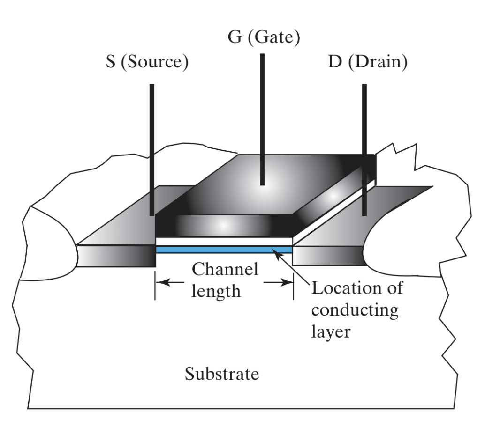
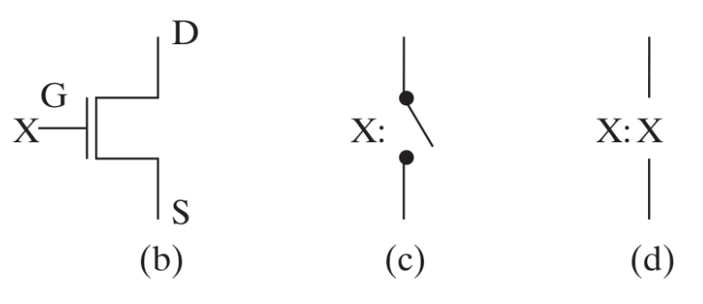
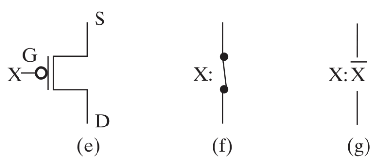
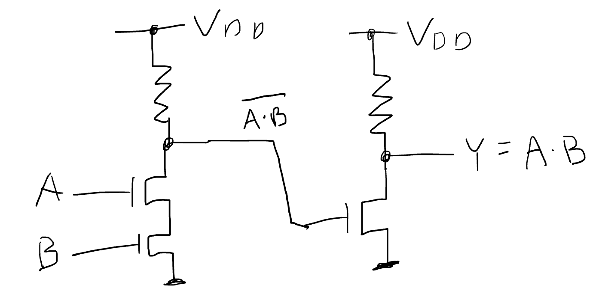
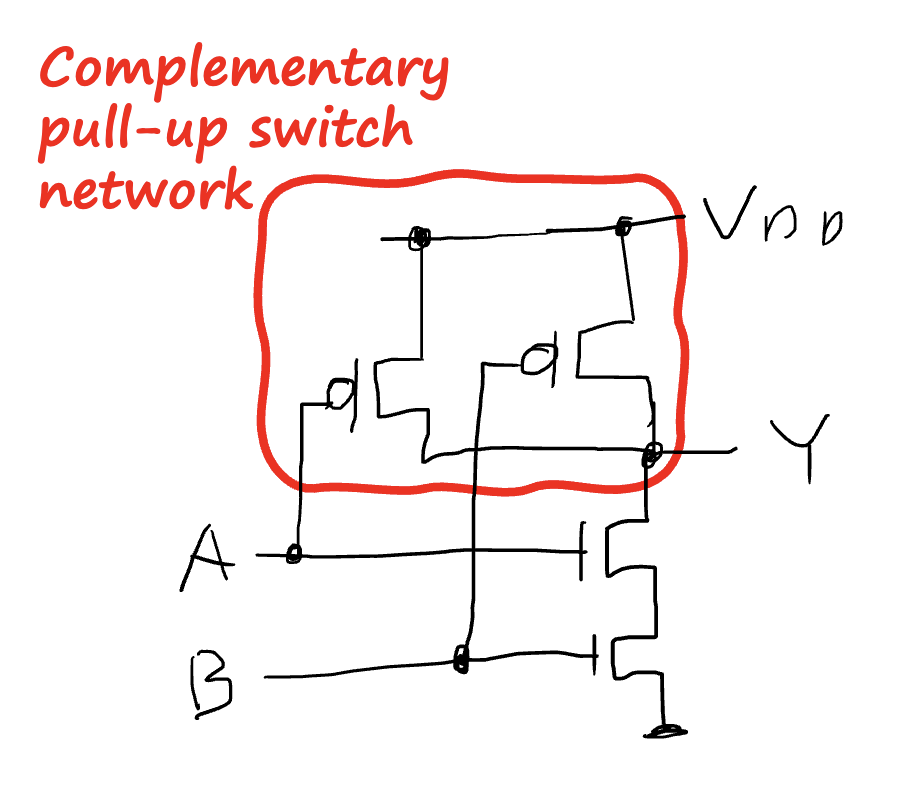
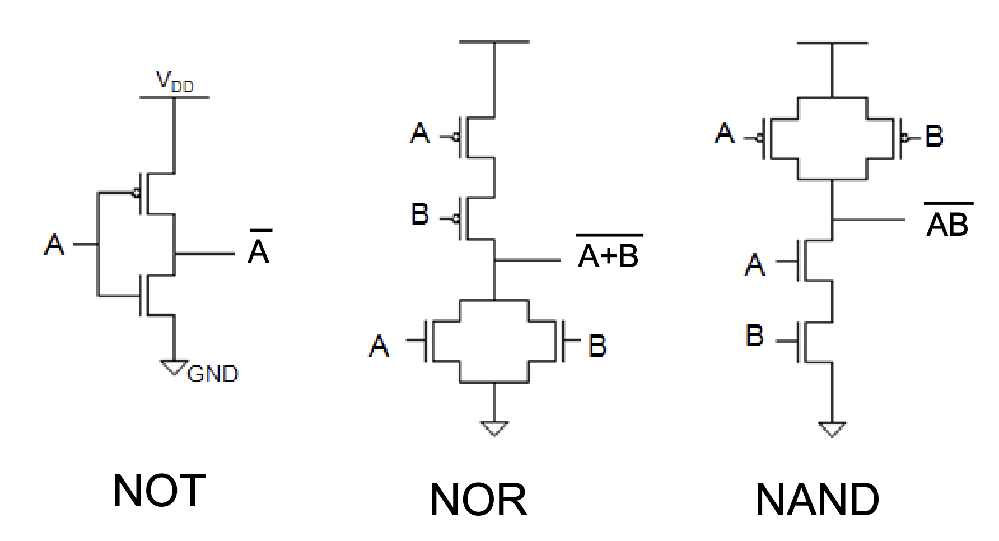

# Digital Hardware Implementation

## 1. The Design Space
The **Design Space** describes the target technologies available for a design and the parameters (metrics) used to characterize them.
* **Target Technology:** Specifies the primitive elements (gates, flip-flops) and their physical properties.
* **Parameters:** Metrics such as speed (propagation delay), power consumption, and silicon area used to evaluate design trade-offs.

---

## 2. Integrated Circuits (ICs)
An **Integrated Circuit** (or **chip**) is a silicon semiconductor crystal containing the components (transistors, resistors, etc.) and connections that constitute a digital circuit.

---

## 3. Levels of Integration
Hardware complexity is categorized by the number of gates per chip:

| Level | Name | Gate Count | Typical Applications |
| :--- | :--- | :--- | :--- |
| **SSI** | Small-Scale Integration | < 10 | Individual gates, simple latches |
| **MSI** | Medium-Scale Integration | 10 – 100 | Adders, MUXs, Decoders, Counters |
| **LSI** | Large-Scale Integration | 100 – 10,000 | 8-bit CPUs, memory chips |
| **VLSI** | Very Large-Scale Integration | > 10,000 | Modern processors, complex FPGAs |

---

## 4. CMOS Technology
**CMOS** (Complementary Metal-Oxide Semiconductor) is the industry-standard fabrication technology for high-density chips.

* **Structure:** Uses paired **NMOS** and **PMOS** transistors.
* **Function:** Because one transistor is always OFF while the other is ON (complementary), the circuit draws almost zero power when in a steady state (static).

---

## 5. MOS Transistor Structure
The **MOS** (Metal-Oxide-Semiconductor) transistor is the fundamental component of CMOS technology, acting as a voltage-controlled switch.

### 5.1 Physical Components
* **Substrate:** The base silicon wafer material.
* **Source & Drain:** Conductive regions where current enters and exits.
* **Gate:** The control terminal that determines if the switch is ON or OFF.
* **Insulator:** A thin oxide layer that prevents current from leaking from the gate into the substrate.
* **Channel:** The gap under the gate that connects the source and drain when a specific voltage is applied.

### 5.2 Operation (Switch Model)
* **ON State:** When gate voltage exceeds a **threshold**, a conductive "bridge" (channel) forms, allowing current to flow.
* **OFF State:** When gate voltage is below the threshold, the channel disappears, blocking current.

---

## 6. Transistor Types: nMOS vs. pMOS
CMOS circuits use two types of MOS transistors to ensure signals remain "strong" (reaching full voltage levels).

### 6.1 nMOS (n-channel)

* **Logic:** Turns **ON** when Gate is **High (1)**.
* **Strength:** Passes a **Strong 0** (Full Ground).
* **Weakness:** Passes a **Weak 1**. It shuts itself off before the output reaches the full supply voltage.
* **Network:** Used in the **Pull-Down Network** (connecting output to Ground).

### 6.2 pMOS (p-channel)

* **Logic:** Turns **ON** when Gate is **Low (0)** (Symbol has a **bubble** $\circ$).
* **Strength:** Passes a **Strong 1** (Full $V_{DD}$).
* **Weakness:** Passes a **Weak 0**. It shuts itself off before the output reaches 0V.
* **Network:** Used in the **Pull-Up Network** (connecting output to $V_{DD}$).

---

## 7. Comparison Summary Table

| Feature | nMOS | pMOS |
| :--- | :--- | :--- |
| **Gate Symbol** | No bubble | Bubble ($\circ$) |
| **ON State** | $V_G = 1$ (High) | $V_G = 0$ (Low) |
| **Strong Signal** | **0** (Ground) | **1** ($V_{DD}$) |
| **Weak Signal** | **1** (Faded) | **0** (Faded) |
| **Placement** | Pull-Down Network | Pull-Up Network |

---

## 8. nMOS Logic Gates
nMOS logic relies on a **Pull-Down Network** of transistors and a **Pull-Up Resistor**.

### 8.1 The Pull-Up / Pull-Down Mechanism
* **Pull-Down (nMOS):** When transistors are **ON**, they "pull" the output voltage down to **0**.
* **Pull-Up (Resistor):** When transistors are **OFF**, the resistor "pulls" the output voltage up to **1**.

### 8.2 NAND vs. NOR Configuration
| Gate | Configuration | Logic (Pull-Down Action) |
| :--- | :--- | :--- |
| **NOR** | **Parallel** | If **A OR B** is 1, output is pulled to **0**. |
| **NAND** | **Series** | Only if **A AND B** are 1, output is pulled to **0**. |

### 8.3 nMOS AND Gate

* Built by following a NAND configuration with an Inverter stage.

---

## 9. Noise Margin
**Noise Margin** is the measure of a circuit's robustness against electrical interference.

* **Low Noise Margin ($NM_L$):** $NM_L = V_{IL} - V_{OL}$
* **High Noise Margin ($NM_H$):** $NM_H = V_{OH} - V_{IH}$
* **Forbidden Region:** The uncertain range between $V_{IL}$ and $V_{IH}$.

---

## 10. The Power vs. Speed Trade-off
* **Low Power:** Requires **High Resistance ($R$)** to limit static current.
* **High Speed:** Requires **Low Resistance ($R$)** to charge load capacitance ($C$) faster.

---

## 11. CMOS (Complementary MOS)
CMOS replaces the resistor with an active **pMOS transistor**.

* **Static Power:** Near zero; current only flows during switching.
* **Switching Speed:** Active pMOS reduces propagation delay.
* **Signal Strength:** Rail-to-Rail outputs (Strong 1s and 0s).

---

## 12. Programming Technologies
Methods for physically establishing logical connections:

* **Mask Programming:** Hard-wired at fabrication; no flexibility.
* **Fuse/Antifuse:** One-Time Programmable (OTP).
* **SRAM-based:** Volatile; used in most FPGAs.
* **Floating Gate:** Non-volatile; used in EEPROM and Flash.

---

## 13. PLDs vs. Custom VLSI (ASICs)
* **PLDs:** Off-the-shelf, low NRE cost, fast time-to-market.
* **ASICs:** Custom-etched, high NRE cost, best performance/power for mass production.

---

## 14. Memory Erasure and Array Logic

### 14.1 Erasure
* **EPROM:** UV light.
* **EEPROM:** Higher voltage (byte-by-byte).
* **Flash:** High-density electrical erase (blocks/sectors).

### 14.2 Array Logic Symbology
* **Single Line:** Represents multiple inputs.
* **'X' at intersection:** Closed connection.

---

## 15. Read-Only Memory (ROM)
ROM is treated as a combinational circuit that implements any Boolean function.

### 15.1 Core Architecture
* **Look-Up Table (LUT):** Inputs act as the **Address** and outputs as the **Data**.
* **n-to-$2^n$ Decoder:** Activates exactly one word line based on the input.
* **Output OR Gates:** Sum the minterms selected by the decoder.

### 15.2 Structural Comparison

| Device Type | AND Array | OR Array | Use Case |
| :--- | :--- | :--- | :--- |
| **PROM** | Fixed | **Programmable** | Truth tables, firmware storage |
| **PAL** | **Programmable** | Fixed | General combinational logic |
| **PLA** | **Programmable** | **Programmable** | Complex, optimized logic functions |