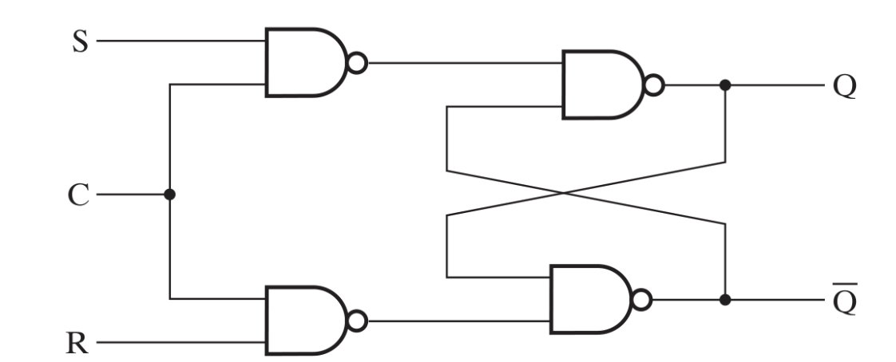
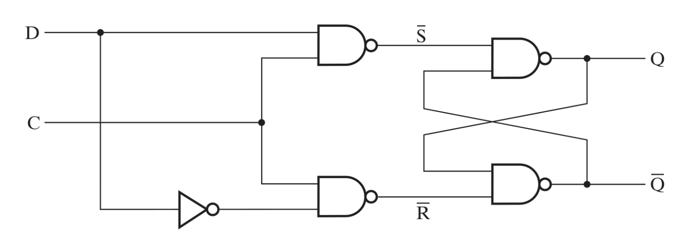
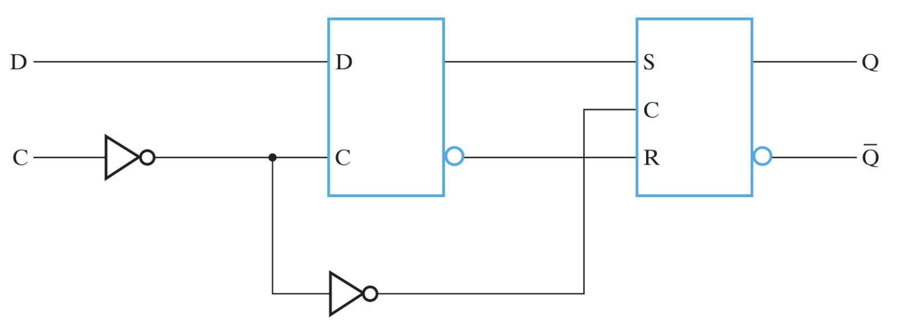
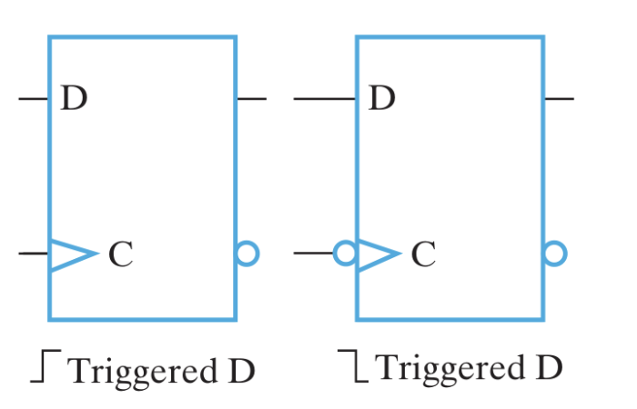

# Sequential Circuits

A sequential circuit stores information between operations, meaning its output depends on both current inputs and the history of past inputs.

## 1.1 Storage Elements and State
* **State**: The binary information stored in the circuit's memory at any given time.
* **Memory Elements**: Typically implemented using latches or flip-flops to maintain the current state.
* **Next State**: Determined by a function of the current inputs and the current state.

---

## 1.2 Synchronous vs. Asynchronous
* **Synchronous**: Employs signals that affect storage elements only at discrete instants of time.
* **Clock Generator**: A timing device that produces a periodic train of clock pulses to achieve synchronization.
* **Pulse Distribution**: Pulses are distributed so that synchronous storage elements are affected only in a specified relationship to every pulse.
* **Asynchronous**: Transitions occur immediately whenever there is a change in the input signals, relying on internal propagation delays rather than a clock.

---

## 1.3 Latches (Level-Sensitive)
Latches are the most basic storage elements and respond to the logic level of the input signal.

#### 1.3.1 SR Latch (Active-High)
Built using **NOR gates**.
* **S=1, R=0**: Set ($Q=1$).
* **S=0, R=1**: Reset ($Q=0$).
* **S=0, R=0**: No change (Memory).
* **Invalid State ($S=1, R=1$)**: Both outputs are forced to 0, breaking the complementary relationship between $Q$ and $\bar{Q}$.

#### 1.3.2 S'R' Latch (Active-Low)
Built using **NAND gates**.
* **S'=0, R'=1**: Set ($Q=1$).
* **S'=1, R'=0**: Reset ($Q=0$).
* **S'=1, R'=1**: No change (Memory).
* **Invalid State ($S'=0, R'=0$)**: Both outputs are forced to 1, breaking the complementary relationship between $Q$ and $\bar{Q}$.

---

## 1.4 SR Latch with Control Input
Synchronization is added by a control input ($C$) that determines when the $S$ and $R$ inputs are allowed to affect the state.

#### 1.4.1 Function Table
| C | S | R | Next state of $Q$ |
| :--- | :--- | :--- | :--- |
| 0 | X | X | No change |
| 1 | 0 | 0 | No change |
| 1 | 0 | 1 | $Q = 0$ (Reset) |
| 1 | 1 | 0 | $Q = 1$ (Set) |
| 1 | 1 | 1 | Undefined/Invalid |

#### 1.4.2 The Undefined State and Control Transitions
When $C=1$ and $S=R=1$, the internal latch stage receives a $(0,0)$ signal, forcing $Q = \bar{Q} = 1$.
* **Race Condition**: If $C$ returns to $0$, the internal signals transition from $(0,0)$ to $(1,1)$ (the "Hold" command).
* **Inconclusive Result**: The circuit must suddenly "Hold" an illegal state. The gates will "race" to settle; if the $Q$ gate is faster, it stays 1, otherwise it flips to 0. Because this depends on microscopic propagation delays, the next state cannot be determined.

---

## 1.5 D Latch
The D Latch eliminates the undefined state found in the SR latch by ensuring inputs are always complements.

#### 1.5.1 Function Table
| C | D | Next state of $Q$ |
| :--- | :--- | :--- |
| 0 | X | No change |
| 1 | 0 | $Q = 0$; Reset state |
| 1 | 1 | $Q = 1$; Set state |

---

## 1.6 Flip-Flops (Edge-Triggered)
Flip-flops change state only at the specific instant of a clock transition (edge), acting as a security airlock to prevent feedback issues.

#### 1.6.1 Master-Slave D Flip-Flop
Constructed by connecting two D-latches in series with an inverted clock signal.

* **Master Latch**: Receives external $D$. It is **"Open" (Transparent)** when $CLK=0$ ($Q_{master}$ follows $D$).
* **Slave Latch**: Receives Master output. It is **"Closed" (Latched)** when $CLK=0$, holding $Q_{final}$.
* **The Transition ($0 \to 1$)**: At the rising edge, the Master closes (locking $D$) and the Slave opens (passing that value to the output).
* **Transparency Definition**: 
    * **Open**: Output follows input immediately.
    * **Closed**: Output is disconnected from input and holds the last seen value.

#### 1.6.2 Edge-Triggered Symbols and Logic
The dynamic indicator (triangle) denotes response to a clock edge.

* **Positive-Edge**: Represented by a small triangle ($\Delta$) at the clock input.
* **Negative-Edge**: Represented by a bubble and a triangle.

#### 1.6.3 Truth Table (Positive Edge)
| Clock | D | Next State ($Q$) |
| :--- | :--- | :--- |
| $\uparrow$ | 0 | 0 |
| $\uparrow$ | 1 | 1 |
| 0, 1, or $\downarrow$ | X | No Change |

#### 1.6.4 Comparison: Latch vs. Flip-Flop
| Feature | Latch | Flip-Flop |
| :--- | :--- | :--- |
| **Trigger** | Level-Sensitive | Edge-Triggered |
| **Timing** | Changes while Enable is active | Changes only at the clock edge |
| **Usage** | Simple storage | Synchronous logic, Registers |

---

## 1.7 Direct Inputs (Asynchronous Inputs)
Direct inputs force the flip-flop into a specific state immediately, regardless of the clock.

* **Asynchronous (Direct) Inputs**: Affect the output immediately.
* **Direct Set (Preset)**: Forces the state to $Q=1$.
* **Direct Reset (Clear)**: Forces the state to $Q=0$.
* **Active-Low Logic**: Indicated by a bubble; a **0** triggers the input. Maintain at **1** for normal operation.

---

## 2. Mealy and Moore Machines

| Feature | Moore Machine | Mealy Machine |
| :--- | :--- | :--- |
| **Output depends on** | Current State only | Current State **and** Current Inputs |
| **Placement** | Inside state bubble (`State/Output`) | On transition arrow (`Input/Output`) |
| **Reaction** | Changes only at clock edge | Can change immediately if input changes |

---

## 3. State Diagrams

* **Circles (Bubbles)**: Represent distinct states.
* **Arrows**: Represent transitions triggered by inputs.
* **Labels**: 
    * **Moore**: `S0/1` (State $S_0$ has output 1).
    * **Mealy**: `0/1` (Input 0 causes output 1 during transition).

---

## 4. Sequential Design Procedure

1.  **State Diagram**: Map logic from a word description.
2.  **State Table**: List Present State, Next State, and Outputs.
3.  **State Assignment**: Assign binary codes to states.
4.  **Flip-Flop Selection**: Choose type (e.g., D Flip-Flop) and quantity.
5.  **Excitation & Output Equations**: Use **K-maps** for Boolean expressions.
6.  **Logic Diagram**: Draw final circuit with gates and flip-flops.